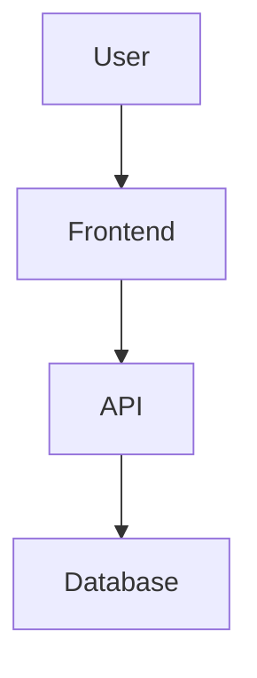

# Markdown to DOCX Converter with Mermaid Support

## ✅ Installation Complete!

Your Markdown to DOCX converter with Mermaid diagram support is now ready to use.

## 📁 Files Created

- `md_to_docx.py` - Main converter script
- `demo.py` - Interactive demo script
- `sample.md` - Comprehensive example with various Mermaid diagrams
- `example.md` - Simple example
- `sample_output.docx` - Converted output from sample.md
- `example_output.docx` - Converted output from example.md
- `README.md` - Basic documentation
- `USAGE.md` - This file

## 🚀 How to Use

### Command Line Usage

```bash
python md_to_docx.py input.md output.docx
```

### Interactive Demo

```bash
python demo.py
```

The demo will show you available Markdown files and let you select one to convert.

## 📋 Features

✅ **Markdown Support**
- Headers (H1-H6)
- Paragraphs
- Lists (bullet and numbered)
- Code blocks
- Basic formatting

✅ **Mermaid Diagrams**
- Flowcharts
- Sequence diagrams
- Class diagrams
- State diagrams
- And many more Mermaid diagram types

✅ **Output Quality**
- High-resolution PNG images (1200x800)
- Proper image sizing in DOCX
- Center-aligned diagrams
- Clean formatting

## 🛠️ Prerequisites (Already Installed)

- ✅ Python 3.12.4
- ✅ python-docx
- ✅ markdown
- ✅ pillow
- ✅ Node.js 20.11.0
- ✅ Mermaid CLI (mmdc) 11.6.0

## 📝 Example Markdown with Mermaid

```markdown
# My Document

## System Overview

Here's our architecture:



Text continues after the diagram...
```

## 🔧 Supported Mermaid Diagrams

- Flowcharts (`flowchart`, `graph`)
- Sequence diagrams (`sequenceDiagram`)
- Class diagrams (`classDiagram`)
- State diagrams (`stateDiagram-v2`)
- Entity relationship diagrams (`erDiagram`)
- User journey diagrams (`journey`)
- Gantt charts (`gantt`)
- Pie charts (`pie`)
- And more...

## 🎯 Tips

1. **Large Documents**: The converter handles multiple diagrams efficiently
2. **Image Quality**: Diagrams are generated at high resolution for print quality
3. **Error Handling**: If a diagram fails to generate, it shows an error message instead
4. **Temporary Files**: All temporary files are automatically cleaned up

## 🚨 Troubleshooting

If you encounter issues:

1. **Mermaid CLI not found**: The converter automatically finds mmdc in common locations
2. **Diagram syntax errors**: Check your Mermaid syntax at https://mermaid.live/
3. **Large files**: Very large Markdown files are supported

## 🎉 Ready to Use!

Your converter is fully functional. Try it with the provided examples:

```bash
# Convert the comprehensive sample
python md_to_docx.py sample.md my_output.docx

# Convert the simple example  
python md_to_docx.py example.md simple_output.docx

# Use the interactive demo
python demo.py
```

The app runs without any additional steps - everything is set up and ready to go!
