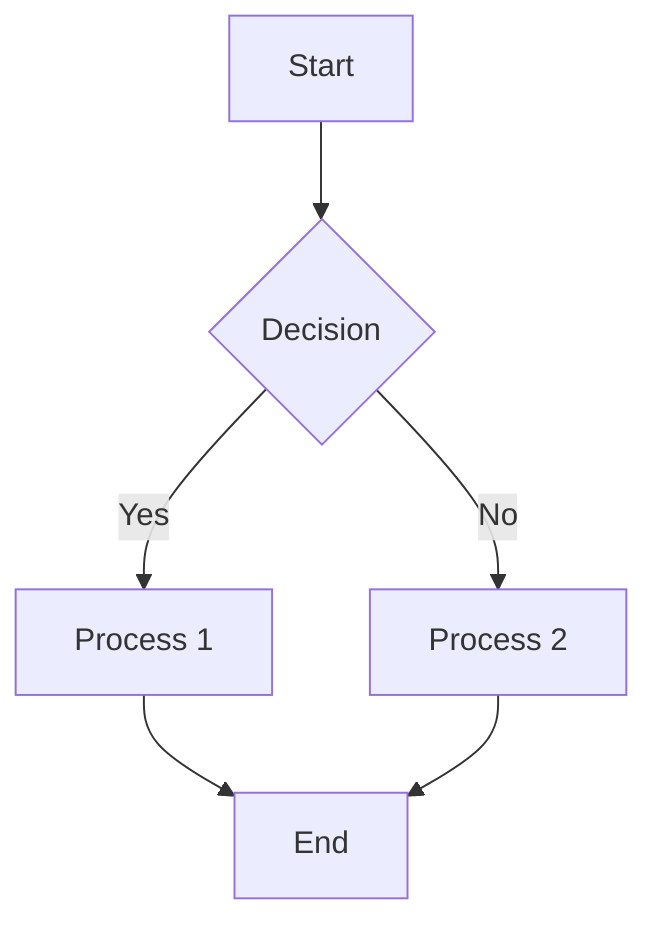

# Markdown to DOCX Converter - Web Application

A Flask web application that provides a user-friendly interface for converting Markdown files to DOCX format with Mermaid diagram support.

## Features

- **Web Interface**: Clean, responsive web UI built with Bootstrap
- **File Upload**: Drag & drop or browse to upload markdown files
- **Text Input**: Paste markdown content directly into a text area
- **Live Preview**: Real-time HTML preview of your markdown content
- **Mermaid Diagrams**: Full support for Mermaid diagrams (converted to images in DOCX)
- **Download**: Automatic download of converted DOCX files

## Prerequisites

1. **Python 3.x** installed
2. **Node.js** installed (for Mermaid CLI)
3. **Mermaid CLI**: Install with `npm install -g @mermaid-js/mermaid-cli`

## Installation

1. Install Python dependencies:
```bash
pip install -r requirements.txt
```

2. Install Mermaid CLI (if not already installed):
```bash
npm install -g @mermaid-js/mermaid-cli
```

## Usage

1. Start the web application:
```bash
python app.py
```

2. Open your web browser and go to: `http://localhost:5000`

3. Choose one of two input methods:
   - **Upload File**: Drag & drop or browse to select a .md file
   - **Paste Text**: Copy and paste your markdown content

4. Preview your content in real-time

5. Click "Convert to DOCX" to generate and download your Word document

## Supported Markdown Features

- Headers (H1-H6)
- Bold and italic text
- Lists (ordered and unordered)
- Tables
- Code blocks with syntax highlighting
- Links and images
- **Mermaid diagrams** (converted to images)

## Example Mermaid Diagram



## File Structure

- `app.py` - Main Flask application
- `md_to_docx.py` - Core conversion logic
- `templates/index.html` - Web interface
- `uploads/` - Temporary uploaded files (auto-cleaned)
- `outputs/` - Generated DOCX files (auto-cleaned)

## Configuration

The application automatically:
- Creates necessary directories
- Cleans up temporary files after 1 hour
- Limits file uploads to 16MB
- Accepts .md, .txt, and .markdown files

## Troubleshooting

**Mermaid diagrams not working?**
- Ensure Node.js is installed
- Install Mermaid CLI: `npm install -g @mermaid-js/mermaid-cli`
- Check if `mmdc` command is available in your PATH

**File upload issues?**
- Check file size (max 16MB)
- Ensure file has .md, .txt, or .markdown extension

## Security Notes

- For production use, change the Flask secret key in `app.py`
- Consider adding authentication for public deployments
- Files are automatically cleaned up after 1 hour
